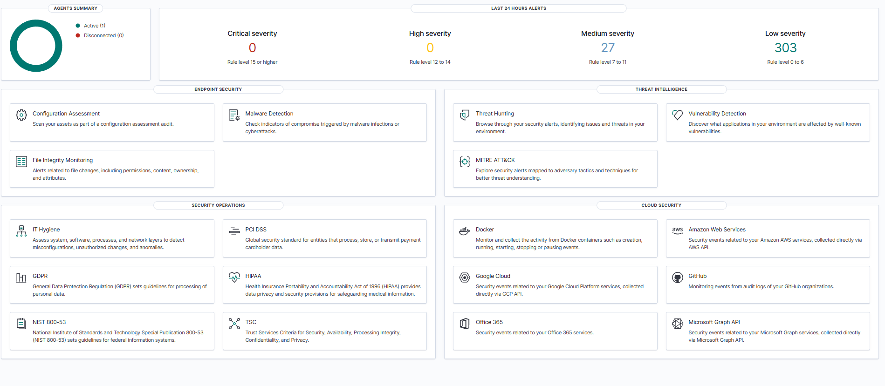

# Wazuh SOC Homelab Deployment

A hands-on Security Information and Event Management (SIEM) homelab project focused on deploying, configuring, and testing Wazuh for security monitoring and detection engineering practice.

This project demonstrates the implementation of a Wazuh environment integrated with a Windows endpoint to monitor logs, generate alerts, and build custom detection rules.

---

## Project Objectives

This project was built to strengthen practical skills in:

- SIEM deployment and configuration
- Security monitoring
- Windows log analysis
- Detection engineering
- Custom rule creation
- SOC alert investigation
- Security event correlation

---

## Architecture Overview

```text
+----------------------+
| Windows Endpoint     |
| (Wazuh Agent)        |
+----------+-----------+
           |
           v
+----------------------+
| Wazuh Manager        |
| Ubuntu Server        |
+----------+-----------+
           |
           v
+----------------------+
| Wazuh Dashboard      |
| Monitoring & Alerts  |
+----------------------+
```

---

## Lab Environment

| Component | Details |
|------------|---------|
| Host OS | Windows 11 |
| Virtualization | VirtualBox |
| Guest OS | Ubuntu Server |
| SIEM Platform | Wazuh |
| Endpoint Monitoring | Windows Agent |
| Purpose | Security Monitoring Homelab |

---

## Features Implemented

### ✅ Wazuh Deployment
- Installed and configured Wazuh SIEM
- Verified dashboard accessibility
- Confirmed manager functionality

### ✅ Windows Endpoint Monitoring
- Installed Wazuh Agent on Windows endpoint
- Connected endpoint to Wazuh Manager
- Validated active agent communication

### ✅ Log Collection
- Collected Windows Event Logs
- Verified log ingestion into Wazuh dashboard

### ✅ Login Failure Detection
**Use Case:** Failed Windows login monitoring

**Description:**  
Detects failed login attempts from Windows Event Logs to identify authentication failures and possible brute-force activities.

**Windows Event ID:**  
`4625`

**Detection Result:**  
Successfully detected and generated alerts in Wazuh dashboard.

---

## Detection Rules

### 1. Failed Login Detection

| Category | Details |
|----------|---------|
| Event Type | Authentication Failure |
| Event ID | 4625 |
| Severity | Medium |
| Status | Implemented |

**Purpose:**  
Identify failed authentication attempts for security monitoring and investigation.

---

## Deployment Process

The following steps were completed during deployment:

1. Installed VirtualBox environment
2. Created Ubuntu Server VM
3. Installed Docker dependencies
4. Deployed Wazuh stack
5. Configured Wazuh Dashboard
6. Installed Windows Wazuh Agent
7. Connected endpoint to manager
8. Validated log ingestion
9. Tested login failure detection

---

## Screenshots

### Wazuh Dashboard

Add screenshot here:



---

### Agent Connected

Add screenshot here:


---

### Login Failure Alert Detection


---

## Challenges & Troubleshooting

During deployment, several challenges were encountered:

- Wazuh dashboard connectivity issues
- Docker configuration troubleshooting
- Agent communication setup
- Event log visibility validation
- Custom detection rule testing

These issues helped improve troubleshooting, system administration, and security monitoring skills.

---

## Lessons Learned

Through this project, I gained hands-on experience in:

- Deploying a SIEM platform
- Understanding log ingestion flow
- Security event monitoring
- Windows Event Log analysis
- Writing and testing detection rules
- Investigating authentication-related alerts

---

## Future Improvements

Planned enhancements for this homelab include:

- [ ] Brute-force login detection
- [ ] Successful login after failed attempts correlation
- [ ] Privilege escalation detection
- [ ] New local administrator account detection
- [ ] Multi-endpoint monitoring
- [ ] Sigma rule integration
- [ ] MITRE ATT&CK mapping

---

## Repository Structure

```text
wazuh-soc-homelab/
│── README.md
│
├── screenshots/
│   ├── wazuh-dashboard.png
│   ├── agent-connected.png
│   ├── login-failure-alert.png
│
├── config/
│   ├── local_rules.xml
│   ├── ossec.conf
│
├── detections/
│   ├── login-failure.md
│
└── documentation/
    └── deployment-notes.md
```

---

## Author

**Achmad Fuad Abizar**  
Security Operations Center (SOC) Analyst

---

## Disclaimer

This project was built in a controlled homelab environment for educational and learning purposes only.