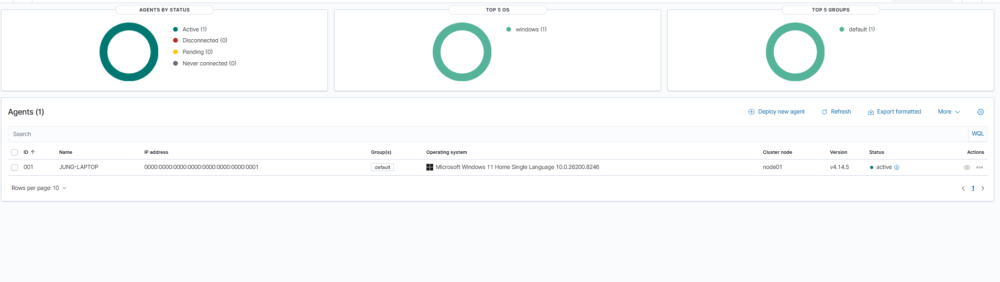
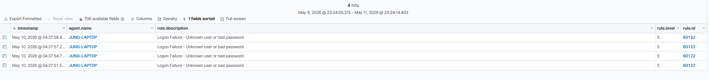
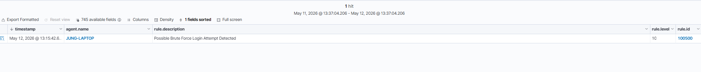

# Wazuh SOC Homelab Deployment

A hands-on Security Information and Event Management (SIEM) homelab project focused on deploying, configuring, and testing Wazuh for security monitoring and detection engineering practice.

This project demonstrates the implementation of a Wazuh environment integrated with a Windows endpoint to monitor logs, generate alerts, and build custom detection rules.

---

## Project Objectives

This project was built to strengthen practical skills in:

- SIEM deployment and configuration
- Security monitoring
- Windows log analysis
- Detection engineering
- Custom rule creation
- SOC alert investigation
- Security event correlation

---

## Architecture Overview

```text
+-----------------------------+
| Windows 11 Host             |
| - Wazuh Agent               |
| - Windows Event Logs        |
+--------------+--------------+
               |
               v
+-----------------------------+
| Ubuntu Environment          |
| Docker Engine               |
+--------------+--------------+
               |
               v
+-----------------------------+
| Wazuh Manager Container     |
| Wazuh Indexer Container     |
| Wazuh Dashboard Container   |
+-----------------------------+
```

---

## Lab Environment

| Component | Details |
|------------|---------|
| Host OS | Windows 11 |
| Linux Environment | Ubuntu on WSL |
| Containerization | Docker Engine |
| SIEM Platform | Wazuh |
| Deployment Method | Docker-based Wazuh deployment |
| Endpoint Monitoring | Windows Wazuh Agent |
| Monitored Endpoint | Windows 11 |
| Purpose | Security Monitoring and Detection Engineering Homelab |
---

## Features Implemented

### ✅ Wazuh Deployment
- Installed and configured Wazuh SIEM
- Verified dashboard accessibility
- Confirmed manager functionality

### ✅ Windows Endpoint Monitoring
- Installed Wazuh Agent on Windows endpoint
- Connected endpoint to Wazuh Manager
- Validated active agent communication

### ✅ Log Collection
- Collected Windows Event Logs
- Verified log ingestion into Wazuh dashboard

### ✅ Login Failure Detection
**Use Case:** Failed Windows login monitoring

**Description:**  
Detects failed login attempts from Windows Event Logs to identify authentication failures and possible brute-force activities.

**Windows Event ID:**  
`4625`

**Detection Result:**  
Successfully detected and generated alerts in Wazuh dashboard.

---

## Detection Rules

### 1. Failed Login Detection

| Category | Details |
|----------|---------|
| Event Type | Authentication Failure |
| Event ID | 4625 |
| Severity | Medium |
| Status | Implemented |

**Purpose:**  
Identify failed authentication attempts for security monitoring and investigation.

---

## Deployment Process

This project was deployed using a Docker-based Wazuh setup from an Ubuntu environment on a Windows 11 host.

### 1. Environment Preparation
- Prepared Ubuntu environment on Windows
- Installed Docker Engine and Docker Compose dependencies
- Verified Docker service and container runtime

### 2. Wazuh Stack Deployment
- Deployed Wazuh Manager, Wazuh Indexer, and Wazuh Dashboard using Docker
- Verified all Wazuh containers were running properly
- Accessed the Wazuh Dashboard through localhost

### 3. Endpoint Integration
- Installed the Wazuh Agent on the Windows endpoint
- Connected the Windows endpoint to the Wazuh Manager
- Verified agent status from the Wazuh Dashboard

### 4. Log Ingestion Validation
- Validated Windows Event Log collection
- Confirmed authentication-related logs were ingested into Wazuh
- Tested failed login telemetry using Windows Event ID 4625

### 5. Detection Engineering
- Created a custom detection rule for Windows failed login events
- Created a brute-force detection rule for 5 failed logins within 120 seconds
- Created a correlation rule for successful login after multiple failed attempts
- Mapped detections to MITRE ATT&CK techniques
- Validated alerts through controlled testing

---

## Screenshots

### Wazuh Dashboard


---

### Agent Connected




---

### Login Failure Alert Detection



---

## Implemented Detections

### Windows Failed Login Detection (Event ID 4625)

Detects Windows failed authentication attempts.

**Rule ID:** `60122`


---

### Brute Force Detection

Detects 5 failed login attempts within 120 seconds.

**Rule ID:** `100500`  
**MITRE ATT&CK:** `T1110 - Brute Force`



## Challenges & Troubleshooting

During deployment, several challenges were encountered:

- Wazuh dashboard connectivity issues
- Docker configuration troubleshooting
- Agent communication setup
- Event log visibility validation
- Custom detection rule testing

These issues helped improve troubleshooting, system administration, and security monitoring skills.

---

## Lessons Learned

Through this project, I gained hands-on experience in:

- Deploying a SIEM platform
- Understanding log ingestion flow
- Security event monitoring
- Windows Event Log analysis
- Writing and testing detection rules
- Investigating authentication-related alerts

---

## Future Improvements

Planned enhancements for this homelab include:

- [ ] Brute-force login detection
- [ ] Successful login after failed attempts correlation
- [ ] Privilege escalation detection
- [ ] New local administrator account detection
- [ ] Multi-endpoint monitoring
- [ ] Sigma rule integration
- [ ] MITRE ATT&CK mapping

---

## Repository Structure

```text
wazuh-soc-homelab/
│── README.md
│
├── screenshots/
│   ├── wazuh-dashboard.png
│   ├── agent-connected.png
│   ├── login-failure-alert.png
│
├── config/
│   ├── local_rules.xml
│   ├── ossec.conf
│
├── detections/
│   ├── login-failure.md
│
└── documentation/
    └── deployment-notes.md
```

---

## Author

**Achmad Fuad Abizar**  
Security Operations Center (SOC) Analyst

---

## Disclaimer

This project was built in a controlled homelab environment for educational and learning purposes only.
